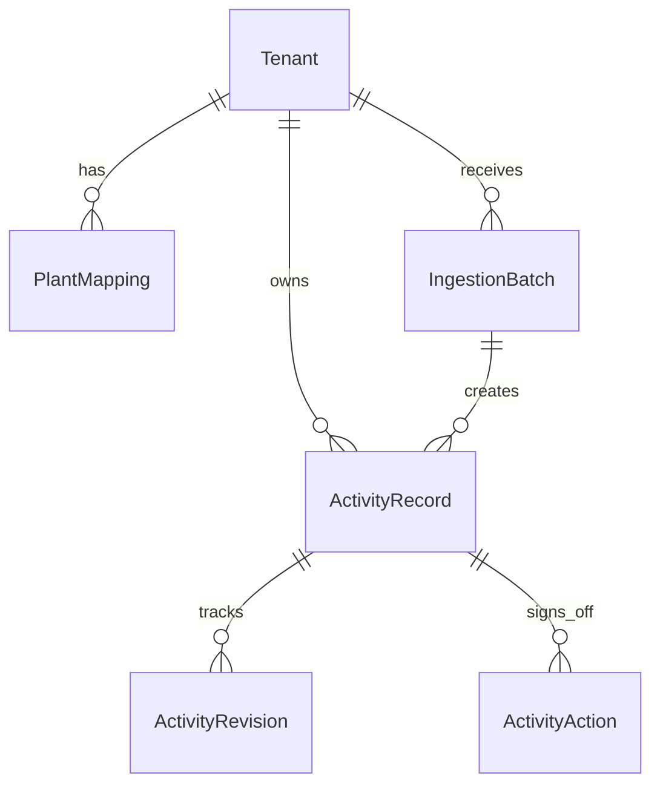

# MODEL

## Goals handled
- Multi-tenancy across enterprise customers.
- Scope 1/2/3 categorization per normalized row.
- Source-of-truth lineage from raw row to normalized record.
- Unit normalization across inconsistent source units.
- Audit trail for edits and analyst sign-off before lock.

## Entity overview

## Tables

### `Tenant`
- Isolation boundary for all business data.
- Key: `slug` for API queries and deployment-safe identifiers.

### `PlantMapping`
- Tenant-scoped lookup mapping SAP `plant_code` -> human facility metadata.
- Handles SAP reality where `WERKS` code is not analyst-friendly.

### `Airport`
- IATA lookup with lat/long.
- Enables travel distance derivation when the source only gives origin/destination airport codes.

### `IngestionBatch`
- One ingestion execution per file upload.
- Stores: source type, row counts, success/failure counts, processing timestamps, and top errors.
- Supports reprocessing diagnostics and operational observability.

### `ActivityRecord`
Canonical normalized ledger row.
- Tenant and batch foreign keys.
- Source lineage: `source_system`, `source_record_id`, `source_payload`.
- Carbon modeling fields:
  - `scope` (`scope_1`, `scope_2`, `scope_3`)
  - `category` / `subcategory`
  - original quantity/unit and normalized quantity/unit
  - optional monetary amount/currency
  - emission factor metadata and computed `emissions_kgco2e`
- Review workflow:
  - `state` (`pending`, `approved`, `rejected`, `locked`)
  - `suspicious` + `suspicion_reasons`
- Constraint: `(tenant, source_system, source_record_id)` unique.

### `ActivityRevision`
- Immutable log of analyst edits.
- Captures `before_state`, `after_state`, `actor`, and optional note.

### `ActivityAction`
- Immutable sign-off log for workflow actions (`approve`, `reject`, `lock`, `edit`).

## Scope mapping policy
- SAP fuel rows (`diesel`, `petrol/gasoline`) -> `Scope 1`.
- SAP procurement material rows -> `Scope 3` (purchased goods).
- Utility electricity rows -> `Scope 2`.
- Travel rows (flight/hotel/ground) -> `Scope 3` (business travel).

## Source-of-truth and edit policy
- `source_payload` stores the raw row/record exactly as ingested.
- Analyst edits update normalized fields but never mutate `source_payload`.
- Locked rows are immutable and protected from re-ingest overwrite.

## Unit normalization policy
- Unit aliases collapse inconsistent labels (`L`, `liter`, `gal`, `kWh`, `MWh`, `mi`, etc.).
- Explicit conversion table used before factor calculation.
- Unmappable units are flagged in `suspicion_reasons`.

## Audit lock behavior
- `lock` action is only allowed on `approved` rows.
- Locked rows cannot be edited or actioned further.
- Re-ingestion with same source key fails for locked rows to preserve audit certainty.
